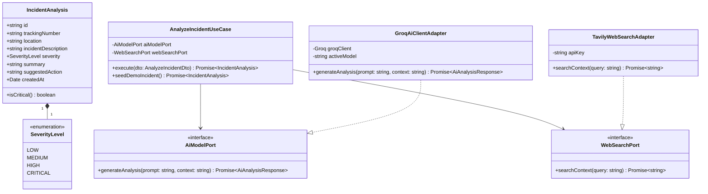

<div align="center">

# 🤖 Microservicio de Inteligencia Artificial (`ai-analytics-service`)
### *Diagnóstico Inteligente de Incidentes Logísticos en Tiempo Real con Groq Cloud LLMs & Tavily Web Search*


</div>

---

## 📖 1. Descripción General & Propósito

El **`ai-analytics-service`** es el módulo de asistencia con **Inteligencia Artificial Generativa** de **LogiPulse AI**. Se encarga de diagnosticar automáticamente incidentes reportados en ruta (e.g., congestión grave, accidentes, cierres viales, condiciones meteorológicas adversas).

Integra dos motores principales:
1. **Tavily Search API**: Agente de búsqueda web en tiempo real para recopilar noticias y reportes de tráfico en el lugar exacto del incidente.
2. **Groq Cloud API (`groq/compound-mini` y modelos de contingencia)**: Inferencia de lenguaje de ultra-alta velocidad que analiza el contexto y responde en **JSON estructurado** con niveles de severidad (`LOW`, `MEDIUM`, `HIGH`, `CRITICAL`), resumen operativo y recomendaciones para el despachador.

---

## 📂 2. Estructura de Directorios & Arquitectura de Carpetas

A continuación se detalla la estructura del código fuente en `src/`, organizada según la **Arquitectura Hexagonal**:

```text
apps/ai-analytics-service/
├── src/
│   ├── domain/                                 # 🧠 CAPA DE DOMINIO (Reglas de Negocio Puras)
│   │   ├── entities/
│   │   │   └── incident-analysis.entity.ts     # Entidad IncidentAnalysis (isCritical, SeverityLevel)
│   │   └── ports/                              # Puertos de Salida (Output Ports)
│   │       ├── ai-model.port.ts                # Contrato para inferencia LLM
│   │       └── web-search.port.ts              # Contrato para agente de búsqueda web
│   │
│   ├── application/                            # ⚙️ CAPA DE APLICACIÓN (Casos de Uso & DTOs)
│   │   ├── dtos/
│   │   │   └── analyze-incident.dto.ts         # DTO con parámetros de incidente a diagnosticar
│   │   └── use-cases/
│   │       └── analyze-incident.use-case.ts    # Orquestación Tavily RAG + Groq Cloud LLM
│   │
│   ├── infrastructure/                         # 🔌 CAPA DE INFRAESTRUCTURA (Adapters & External APIs)
│   │   ├── adapters/
│   │   │   ├── groq-ai-client.adapter.ts       # Adaptador del SDK Groq Cloud (JSON mode, fallbacks)
│   │   │   └── tavily-web-search.adapter.ts    # Adaptador de la API Tavily Search
│   │   ├── http/
│   │   │   └── controllers/
│   │   │       └── ai-analytics.controller.ts  # Controlador REST (@Controller('ai'))
│   │   └── messaging/
│   │       └── consumers/
│   │           └── incident-events.consumer.ts # Consumidor RabbitMQ para eventos de incidentes
│   │
│   ├── main.ts                                 # Bootstrap NestJS (Puerto 3003)
│   ├── ai-analytics.module.ts                  # Módulo con Providers para AiModelPort y WebSearchPort
│   └── tsconfig.build.json                     # Configuración TypeScript rootDir: "src"
│
└── test/                                       # 🧪 PRUEBAS UNITARIAS (Jest)
    └── unit/
        ├── domain/entities/incident-analysis.entity.spec.ts
        ├── application/use-cases/analyze-incident.use-case.spec.ts
        └── infrastructure/
            ├── adapters/groq-ai-client.adapter.spec.ts
            └── http/controllers/ai-analytics.controller.spec.ts
```

---

## 🏛️ 3. Arquitectura Hexagonal y Pipeline de IA

```text
                               ┌────────────────────────────────┐
                               │  RabbitMQ Event: INCIDENT /    │
                               │    REST POST /ai/analyze       │
                               └───────────────┬────────────────┘
                                               │
                                               ▼ (Application Layer)
                               ┌────────────────────────────────┐
                               │     AnalyzeIncidentUseCase     │
                               └───────┬────────────────┬───────┘
                                       │                │
             (WebSearchPort)           │                │         (AiModelPort)
    ┌──────────────────────────────────┘                └──────────────────────────────────┐
    ▼                                                                                      ▼
┌──────────────────────────────┐                                       ┌──────────────────────────────┐
│    TavilyWebSearchAdapter    │                                       │     GroqAiClientAdapter      │
│ (Búsqueda Web en Tiempo Real)│                                       │  (Inferencia LLM JSON Mode)  │
└──────────────┬───────────────┘                                       └──────────────┬───────────────┘
               │                                                                      │
               ▼                                                                      ▼
       [ Tavily Web API ]                                                     [ Groq Cloud API ]
```

---

## 📐 4. Diagrama de Clases UML y Dominio



---

## 🎨 5. Patrones de Diseño & Buenas Prácticas

1. **Structured JSON Output (Groq Cloud API)**:
   - Configuración estricta de `response_format: { type: 'json_object' }` garantizando que las respuestas de los modelos de Groq sean parseables sin errores de sintaxis o expresiones regulares impredecibles.
2. **Strategy & Fallback Pattern para Modelos LLM**:
   - `GroqAiClientAdapter` soporta fallback dinámico de modelos activos (`groq/compound-mini`, `groq/compound`, `openai/gpt-oss-120b`), descartando automáticamente modelos deprecados de Groq Cloud.
3. **Retrieval-Augmented Generation (RAG Light / External Context Injection)**:
   - Inyección de contexto web fresco obtenido desde `TavilyWebSearchAdapter` dentro del prompt del sistema para reducir alucinaciones en modelos de lenguaje.
4. **Hexagonal Architecture**:
   - Total desacoplamiento de los SDKs de Groq y Tavily a través de los puertos `AiModelPort` y `WebSearchPort`.

---

## 📡 6. Especificación de Endpoints REST API

Base URL: `http://localhost:3003`

### 1. Demostración de Análisis de Incidente con IA (`POST /ai/seed-demo`)
- **Descripción:** Dispara un análisis simulado de incidente vial en la comuna de Vitacura/Las Condes para la orden `TRK-100004`.
- **Response `201 Created`**:
```json
{
  "severity": "HIGH",
  "summary": "Congestión vehicular severa reportada en Av. Vitacura debido a colisión entre vehículo particular y transporte de carga.",
  "suggestedAction": "Desviar la camioneta por Av. Presidente Riesco o Costanera Norte para evitar retraso estimado de 45 minutos."
}
```

### 2. Analizar Incidente Personalizado (`POST /ai/analyze-incident`)
- **Request Body**:
```json
{
  "trackingNumber": "TRK-100002",
  "location": "Av. Pajaritos esquina 5 de Abril, Maipú",
  "description": "Falla de semáforos y trabajo en la vía pública"
}
```
- **Response `200 OK`**: Retorna el objeto `IncidentAnalysis` con el diagnóstico completo.

---

## 🧪 7. Estrategia de Testing & Cobertura

Suite de pruebas unitarias desarrollada con **Jest** y Mocks de las APIs externas:

### 🔬 Desglose de Archivos de Prueba:
- `test/unit/domain/entities/incident-analysis.entity.spec.ts`: Reglas de dominio para severidades de incidentes (`isCritical()`).
- `test/unit/application/use-cases/analyze-incident.use-case.spec.ts`: Flujo completo de orquestación Tavily + Groq con Mocks de `AiModelPort` y `WebSearchPort`.
- `test/unit/infrastructure/adapters/groq-ai-client.adapter.spec.ts`: Adaptador del SDK de Groq Cloud.
- `test/unit/infrastructure/http/controllers/ai-analytics.controller.spec.ts`: Controlador HTTP REST.

### 🛠️ Comandos de Prueba:
```bash
# Ejecutar pruebas unitarias
pnpm test

# Generar reporte de cobertura de código
pnpm test:cov
```
