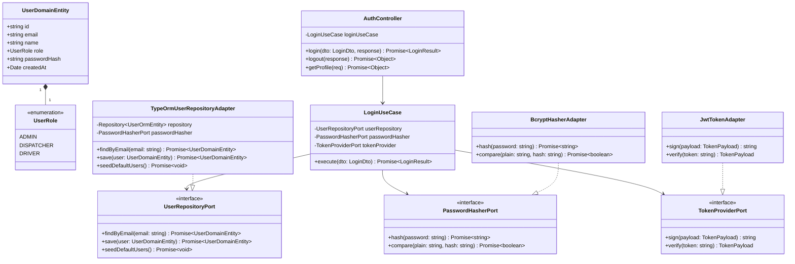

<div align="center">
 
# 🔒 Microservicio de Autenticación (`auth-service`)
### *Gestión de Identidad, Persistencia en PostgreSQL, Emisión de Tokens JWT, Encriptación Bcrypt y Cookies HttpOnly*
 


 
</div>

---

## 📖 1. Descripción General & Propósito

El **`auth-service`** es el microservicio dedicado a la **gestión de identidad, persistencia relacional en PostgreSQL (`logipulse_auth_db`), emisión de tokens JWT y control de accesos por rol (RBAC)** de **LogiPulse AI**.

Alineado con los estándares de **Ciberseguridad OWASP API Security Top 10 (2023)** y **Arquitectura Hexagonal (Database-per-Service)**:
1. **Persistencia Relacional Dedicada (TypeORM + PostgreSQL)**: Almacenamiento aislado de usuarios en la base de datos `logipulse_auth_db` con siembra automática de cuentas demo (`ADMIN`, `DISPATCHER`, `DRIVER`).
2. **Encriptación Segura de Contraseñas (`bcryptjs`)**: Hashing unidireccional y verificación segura de credenciales.
3. **Emisión de Tokens JWT Cortos (`expiresIn: 2h`)**: Firma matemática de tokens con el secreto centralizado `JWT_SECRET`.
4. **Cookies de Sesión HttpOnly (`Set-Cookie`)**: Inmunidad total contra ataques XSS al almacenar tokens inaccesibles desde JavaScript con expiración forzada en cierre de sesión (`maxAge: 0`).

---

## 📂 2. Estructura de Directorios (Arquitectura Hexagonal)

```text
apps/auth-service/
├── src/
│   ├── domain/
│   │   └── ports/
│   │       ├── password-hasher.port.ts
│   │       ├── token-provider.port.ts
│   │       └── user-repository.port.ts
│   ├── application/
│   │   ├── dtos/
│   │   │   └── login.dto.ts
│   │   └── use-cases/
│   │       └── login.use-case.ts
│   ├── infrastructure/
│   │   ├── adapters/
│   │   │   ├── bcrypt-hasher.adapter.ts
│   │   │   └── jwt-token.adapter.ts
│   │   ├── persistence/
│   │   │   ├── adapters/
│   │   │   │   └── typeorm-user-repository.adapter.ts
│   │   │   ├── entities/
│   │   │   │   └── user.orm-entity.ts
│   │   │   └── mappers/
│   │   │       └── user.mapper.ts
│   │   └── http/
│   │       ├── controllers/
│   │       │   ├── auth.controller.ts
│   │       │   └── health.controller.ts
│   │       └── guards/
│   │           ├── jwt-auth.guard.ts
│   │           └── roles.decorator.ts
│   ├── main.ts
│   └── auth-service.module.ts
└── test/
    └── unit/
        ├── application/use-cases/login.use-case.spec.ts
        └── infrastructure/
            ├── http/
            │   ├── controllers/auth.controller.spec.ts
            │   ├── controllers/health.controller.spec.ts
            │   └── guards/jwt-auth.guard.spec.ts
            └── persistence/adapters/typeorm-user-repository.adapter.spec.ts
```

---

## 📐 3. Diagrama de Clases UML y Dominio



---

## 📡 4. Especificación de Endpoints REST API

Base URL: `http://localhost:3004`

### 1. Inicio de Sesión (`POST /auth/login`)
- **Request Body**:
```json
{
  "email": "admin@logipulse.ai",
  "password": "admin123"
}
```
- **Response `200 OK`**:
```json
{
  "accessToken": "eyJhbGciOiJIUzI1NiIsInR5cCI6IkpXVCJ9...",
  "user": {
    "id": "11111111-1111-4111-a111-111111111111",
    "email": "admin@logipulse.ai",
    "name": "Administrador de Logística",
    "role": "ADMIN"
  }
}
```

### 2. Consultar Perfil Activo (`GET /auth/me`)
- **Headers / Cookie**: Requiere cookie `access_token` o `Authorization: Bearer <TOKEN>`.
- **Response `200 OK`**:
```json
{
  "user": {
    "sub": "11111111-1111-4111-a111-111111111111",
    "email": "admin@logipulse.ai",
    "name": "Administrador de Logística",
    "role": "ADMIN"
  }
}
```

### 3. Cierre de Sesión (`POST /auth/logout`)
- **Descripción:** Destruye e invalida la cookie HttpOnly `access_token` con fecha de expiración pasada (`maxAge: 0`).

### 4. Diagnóstico de Salud (`GET /health`)
- **Response `200 OK`**:
```json
{
  "status": "UP",
  "service": "auth-service",
  "jwtProvider": "Active",
  "uptimeSeconds": 120
}
```

---

## 🧪 5. Cobertura de Pruebas Unitarias

* **Resultados**: **5/5 Test Suites Pasadas**, **14/14 Tests Completados (🟢 100% Pass)**.
