<div align="center">

# 📦 Microservicio de Órdenes (`orders-service`)
### *Core Transaccional del Ciclo de Vida de Despachos y Eventos de Negocio*


</div>

---

## 📖 1. Descripción General & Propósito

El **`orders-service`** es el microservicio transaccional primario del ecosistema **LogiPulse AI**. Es responsable de gestionar el ciclo de vida completo de las órdenes de despacho de carga: creación de envíos, asignación de tracking numbers, transiciones de estado de entrega (`CREATED`, `IN_TRANSIT`, `DELIVERED`, `CANCELLED`, `INCIDENT`) y auditoría de cambios.

Garantiza integridad de datos **ACID** a través de **PostgreSQL** (`logipulse_db`) y desacopla la comunicación distribuida mediante la publicación de eventos de dominio en el broker de mensajería **RabbitMQ (AMQP)**.

---

## 📂 2. Estructura de Directorios & Arquitectura Hexagonal

```text
apps/orders-service/
├── src/
│   ├── domain/                                 # 🧠 CAPA DE DOMINIO (Reglas de Negocio Puras)
│   │   ├── entities/
│   │   │   └── order.entity.ts                 # Entidad de Dominio Order con encapsulamiento y toJSON()
│   │   ├── exceptions/
│   │   │   └── order-domain.exception.ts       # Excepciones de negocio personalizadas
│   │   └── ports/                              # Interfaces / Puertos de salida (Output Ports)
│   │       ├── order-repository.port.ts        # Contrato para la persistencia de órdenes
│   │       └── event-publisher.port.ts         # Contrato para la publicación de eventos AMQP
│   │
│   ├── application/                            # ⚙️ CAPA DE APLICACIÓN (Casos de Uso & DTOs)
│   │   ├── dtos/
│   │   │   ├── create-order.dto.ts             # DTO con validaciones class-validator para crear orden
│   │   │   └── update-order-status.dto.ts      # DTO para cambio de estado
│   │   └── use-cases/                          # Orquestación atómica de reglas de negocio
│   │       ├── create-order.use-case.ts        # Crear orden, seeder y emisión order.created
│   │       ├── update-order-status.use-case.ts # Cambio de estado y emisión order.status_updated
│   │       └── get-order-by-id.use-case.ts     # Consultas de lectura por ID
│   │
│   ├── infrastructure/                         # 🔌 CAPA DE INFRAESTRUCTURA (Adapters & Frameworks)
│   │   ├── http/
│   │   │   ├── controllers/
│   │   │   │   ├── order.controller.ts         # Controlador REST (@Controller('orders'))
│   │   │   │   └── health.controller.ts        # Diagnóstico de salud
│   │   │   └── guards/
│   │   │       ├── jwt-auth.guard.ts           # Guardián JWT para verificación de firma
│   │   │       └── roles.decorator.ts          # Decorador RBAC
│   │   ├── persistence/
│   │   │   ├── adapters/
│   │   │   │   └── typeorm-order-repository.adapter.ts # Adaptador TypeORM del OrderRepositoryPort
│   │   │   ├── entities/
│   │   │   │   └── order.orm-entity.ts         # Entidad ORM mapeada a PostgreSQL (@Entity('orders'))
│   │   │   └── mappers/
│   │   │       └── order.mapper.ts             # Mapper conversor (Domain Entity <-> TypeORM Entity)
│   │   └── messaging/
│   │       └── adapters/
│   │           └── rabbitmq-event-publisher.adapter.ts # Adaptador AMQP RabbitMQ ClientProxy
│   │
│   ├── main.ts                                 # Bootstrap del servicio NestJS (Puerto 3001, CORS, Pipes)
│   └── orders.module.ts                        # Módulo NestJS con inyección de dependencias por símbolos
│
└── test/                                       # 🧪 PRUEBAS UNITARIAS (Jest)
    └── unit/
        ├── domain/
        │   ├── entities/order.entity.spec.ts
        │   └── exceptions/order-domain.exception.spec.ts
        ├── application/
        │   └── use-cases/
        │       ├── create-order.use-case.spec.ts
        │       ├── update-order-status.use-case.spec.ts
        │       └── get-order-by-id.use-case.spec.ts
        └── infrastructure/
            ├── http/
            │   ├── controllers/order.controller.spec.ts
            │   ├── controllers/health.controller.spec.ts
            │   └── guards/jwt-auth.guard.spec.ts
            ├── messaging/adapters/rabbitmq-event-publisher.adapter.spec.ts
            └── persistence/
                ├── adapters/typeorm-order-repository.adapter.spec.ts
                └── mappers/order.mapper.spec.ts
```

---

## 🏛️ 3. Arquitectura Hexagonal (Ports & Adapters)

```text
                               ┌────────────────────────────────────────────────────────┐
                               │                    HTTP REST Clients                   │
                               └───────────────────────────┬────────────────────────────┘
                                                           │
                                                           ▼ (Input Adapter)
                               ┌────────────────────────────────────────────────────────┐
                               │                 OrderHttpController                    │
                               └───────────────────────────┬────────────────────────────┘
                                                           │
                                                           ▼ (Application Layer)
                               ┌────────────────────────────────────────────────────────┐
                               │     CreateOrderUseCase / UpdateOrderStatusUseCase      │
                               └─────────────┬────────────────────────────┬─────────────┘
                                             │                            │
                     (Output Port)           │                            │          (Output Port)
           ┌─────────────────────────────────┘                            └─────────────────────────────────┐
           ▼                                                                                                ▼
┌──────────────────────────────┐                                                         ┌──────────────────────────────┐
│     OrderRepositoryPort      │                                                         │      EventPublisherPort      │
└──────────────┬───────────────┘                                                         └──────────────┬───────────────┘
               │                                                                                        │
               ▼ (Output Adapter)                                                                       ▼ (Output Adapter)
┌──────────────────────────────┐                                                         ┌──────────────────────────────┐
│  TypeOrmOrderRepoAdapter     │                                                         │   RabbitMqPublisherAdapter   │
└──────────────┬───────────────┘                                                         └──────────────┬───────────────┘
               │                                                                                        │
               ▼                                                                                        ▼
       [ PostgreSQL DB ]                                                                           [ RabbitMQ ]
```

---

## 📐 4. Diagrama de Clases UML y Dominio

```mermaid
classDiagram
    class Order {
        +string id
        +string trackingNumber
        +string merchantId
        +string originAddress
        +string destinationAddress
        +number price
        +OrderStatus status
        +Date createdAt
        +Date updatedAt
        +updateStatus(newStatus: OrderStatus) void
        +toJSON() Object
    }

    class OrderStatus {
        <<enumeration>>
        CREATED
        IN_TRANSIT
        DELIVERED
        CANCELLED
        INCIDENT
    }

    class CreateOrderUseCase {
        -OrderRepositoryPort orderRepository
        -EventPublisherPort eventPublisher
        +execute(dto: CreateOrderDto) Promise~Order~
        +getAllOrders() Promise~Order[]~
        +seed5Orders() Promise~Order[]~
    }

    class UpdateOrderStatusUseCase {
        -OrderRepositoryPort orderRepository
        -EventPublisherPort eventPublisher
        +execute(id: string, newStatus: OrderStatus) Promise~Order~
    }

    class GetOrderByIdUseCase {
        -OrderRepositoryPort orderRepository
        +execute(id: string) Promise~Order~
    }

    class OrderRepositoryPort {
        <<interface>>
        +save(order: Order) Promise~void~
        +findById(id: string) Promise~Order|null~
        +findByTrackingNumber(trackingNumber: string) Promise~Order|null~
        +findAll() Promise~Order[]~
    }

    class EventPublisherPort {
        <<interface>>
        +publish(pattern: string, payload: any) Promise~void~
    }

    class TypeOrmOrderRepositoryAdapter {
        -Repository~OrderOrmEntity~ repository
        +save(order: Order) Promise~void~
        +findById(id: string) Promise~Order|null~
        +findByTrackingNumber(trackingNumber: string) Promise~Order|null~
        +findAll() Promise~Order[]~
    }

    class RabbitMqEventPublisherAdapter {
        -ClientProxy client
        +publish(pattern: string, payload: any) Promise~void~
    }

    Order "1" *-- "1" OrderStatus
    CreateOrderUseCase --> OrderRepositoryPort
    CreateOrderUseCase --> EventPublisherPort
    UpdateOrderStatusUseCase --> OrderRepositoryPort
    UpdateOrderStatusUseCase --> EventPublisherPort
    GetOrderByIdUseCase --> OrderRepositoryPort
    TypeOrmOrderRepositoryAdapter ..|> OrderRepositoryPort
    RabbitMqEventPublisherAdapter ..|> EventPublisherPort
```



---

## 🎨 5. Patrones de Diseño & Buenas Prácticas

1. **Domain-Driven Design (DDD) Light & Domain Entities**:
   - La entidad `Order` contiene validaciones de dominio y encapsulamiento.
   - Implementa `toJSON()` explícito para evitar problemas de serialización JSON.
2. **Repository Pattern**:
   - `OrderRepositoryPort` define el contrato de persistencia desacoplado de TypeORM.
3. **Event-Driven Architecture (EDA)**:
   - Publicación asíncrona de eventos de dominio (`order.created`, `order.status_updated`) a través de `EventPublisherPort`.
4. **Dependency Inversion Principle (DIP)**:
   - Uso de NestJS Custom Providers mediante símbolos (`ORDER_REPOSITORY_PORT`, `EVENT_PUBLISHER_PORT`).

---

## 🗄️ 6. Esquema de Base de Datos (PostgreSQL)

Mapeo de la entidad ORM `OrderOrmEntity` en la tabla **`orders`**:

| Columna | Tipo SQL | Restricciones | Descripción |
|---|---|---|---|
| `id` | `UUID` | PRIMARY KEY | Identificador universal de la orden |
| `trackingNumber` | `VARCHAR(50)` | UNIQUE, NOT NULL | Código de seguimiento (ej. `TRK-100001`) |
| `merchantId` | `VARCHAR(100)` | NOT NULL | Identificador del comercio solicitante |
| `originAddress` | `VARCHAR(255)` | NOT NULL | Dirección física de origen |
| `destinationAddress` | `VARCHAR(255)` | NOT NULL | Dirección física de destino |
| `price` | `DECIMAL(10,2)` | NOT NULL | Precio/Costo del despacho |
| `status` | `VARCHAR(50)` | NOT NULL | Estado actual de la orden |
| `createdAt` | `TIMESTAMP` | DEFAULT `now()` | Fecha y hora de creación |
| `updatedAt` | `TIMESTAMP` | DEFAULT `now()` | Fecha y hora de última actualización |

---

## 📡 7. Especificación de Endpoints REST API

Base URL: `http://localhost:3001`

### 1. Sembrar Órdenes de Demostración (`POST /orders/seed`)
- **Descripción:** Genera e inserta 5 órdenes de prueba con tracking numbers deterministas (`TRK-100001` a `TRK-100005`) en PostgreSQL y publica los eventos `order.created`.

### 2. Listar Todas las Órdenes (`GET /orders`)
- **Response `200 OK`**: Retorna el listado completo de órdenes registradas.

### 3. Crear Nueva Orden (`POST /orders`)
- **Request Body**:
```json
{
  "merchantId": "merchant-beta",
  "originAddress": "Av. Matta 500, Santiago",
  "destinationAddress": "Av. Grecia 1200, Ñuñoa",
  "price": 18500
}
```

### 4. Obtener Orden por ID (`GET /orders/:id`)
- **Response `200 OK`**: Retorna el objeto de la orden solicitada.

### 5. Actualizar Estado de Orden (`PATCH /orders/:id/status`)
- **Request Body**:
```json
{
  "status": "IN_TRANSIT"
}
```

---

## 🔔 8. Eventos Publicados en RabbitMQ

| Event Pattern | Trigger | Payload JSON Schema |
|---|---|---|
| `order.created` | Creación de orden o ejecucion de seeder | `{ "orderId": string, "trackingNumber": string, "merchantId": string, "status": string, "timestamp": string }` |
| `order.status_updated` | Cambio de estado de una orden | `{ "orderId": string, "trackingNumber": string, "status": string, "updatedAt": string }` |

---

## 🧪 9. Estrategia de Testing & Cobertura

* **Resultados**: **11/11 Test Suites Pasadas**, **38/38 Tests Completados (🟢 100% Pass)**.
