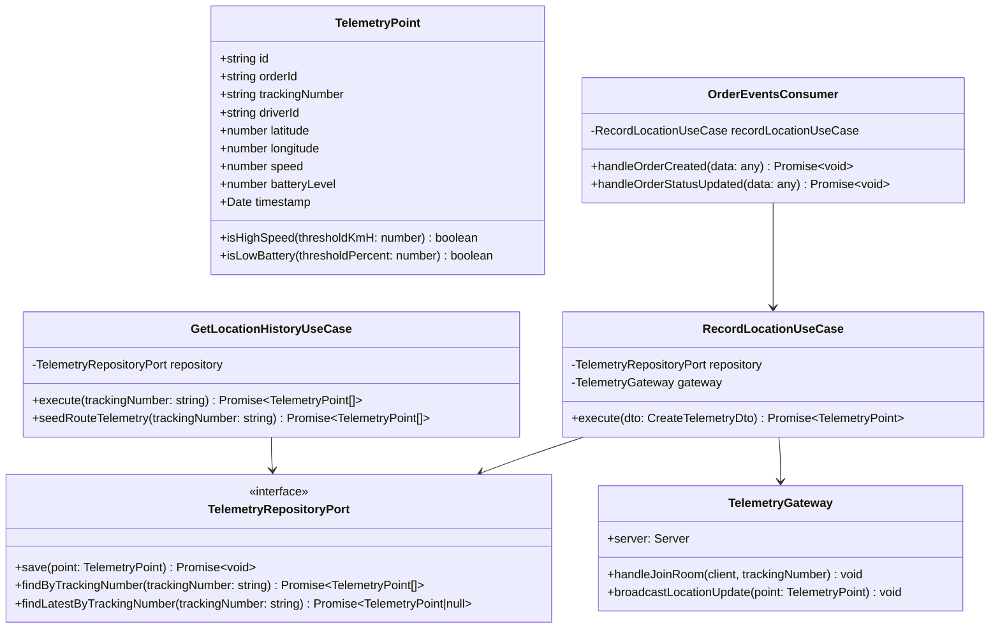

<div align="center">

# 📍 Microservicio de Telemetría GPS (`telemetry-service`)
### *Procesamiento GPS en Tiempo Real, Ingestión NoSQL y Gateways de WebSockets*


</div>

---

## 📖 1. Descripción General & Propósito

El **`telemetry-service`** es el microservicio responsable de la captura, persistencia y transmisión en tiempo real de coordenadas de geolocalización GPS de camionetas y choferes de la flota.

Está optimizado para soportar **ingestión masiva a alta velocidad** mediante **MongoDB (NoSQL)** y distribución inmediata de posición a dashboards y clientes web mediante un **Gateway de WebSockets (Socket.io)**. Además, actúa como consumidor asíncrono de eventos **RabbitMQ** emitidos por otros microservicios.

---

## 📂 2. Estructura de Directorios & Arquitectura de Carpetas

A continuación se detalla la estructura del código fuente en `src/`, organizada según la **Arquitectura Hexagonal**:

```text
apps/telemetry-service/
├── src/
│   ├── domain/                                 # 🧠 CAPA DE DOMINIO (Reglas de Negocio Puras)
│   │   ├── entities/
│   │   │   └── telemetry-point.entity.ts       # Entidad TelemetryPoint (isHighSpeed, isLowBattery)
│   │   └── ports/                              # Puertos de Salida (Output Ports)
│   │       └── telemetry-repository.port.ts    # Contrato para la persistencia NoSQL
│   │
│   ├── application/                            # ⚙️ CAPA DE APLICACIÓN (Casos de Uso & DTOs)
│   │   ├── dtos/
│   │   │   └── record-location.dto.ts          # DTO de captura GPS con validaciones
│   │   └── use-cases/
│   │       ├── record-location.use-case.ts     # Ingestión GPS y emisión vía WebSockets
│   │       └── get-location-history.use-case.ts# Lectura de trayectoria y seeder geográfico
│   │
│   ├── infrastructure/                         # 🔌 CAPA DE INFRAESTRUCTURA (Adapters & Frameworks)
│   │   ├── http/
│   │   │   └── controllers/
│   │   │       └── telemetry.controller.ts     # Controlador REST (@Controller('telemetry'))
│   │   ├── messaging/
│   │   │   └── consumers/
│   │   │       └── order-events.consumer.ts    # Consumidor AMQP RabbitMQ (order.created/updated)
│   │   ├── persistence/
│   │   │   ├── adapters/
│   │   │   │   └── mongoose-telemetry-repository.adapter.ts # Adaptador Mongoose/MongoDB
│   │   │   └── schemas/
│   │   │       └── telemetry.schema.ts         # Esquema de Colección Mongoose gps_telemetry
│   │   └── websockets/
│   │       └── telemetry.gateway.ts            # Gateway Socket.io (@WebSocketGateway)
│   │
│   ├── main.ts                                 # Bootstrap NestJS + Microservicio RabbitMQ Consumer
│   ├── telemetry.module.ts                     # Módulo principal con MongooseModule y Gateways
│   └── tsconfig.build.json                     # Configuración de compilación TypeScript rootDir: "src"
│
└── test/                                       # 🧪 PRUEBAS UNITARIAS (Jest)
    └── unit/
        ├── domain/entities/telemetry-point.entity.spec.ts
        ├── application/use-cases/
        │   ├── record-location.use-case.spec.ts
        │   └── get-location-history.use-case.spec.ts
        └── infrastructure/
            ├── http/controllers/telemetry.controller.spec.ts
            ├── messaging/consumers/order-events.consumer.spec.ts
            ├── persistence/adapters/mongoose-telemetry-repository.adapter.spec.ts
            └── websockets/telemetry.gateway.spec.ts
```

---

## 🏛️ 3. Arquitectura Hexagonal y Flujo de Ingestión

```text
[ Dispositivo Móvil / Chofer ] ── WebSocket / REST API ──┐
                                                         ▼
                                          ┌───────────────────────────────┐
                                          │       TelemetryGateway        │
                                          │      (Socket.io Gateway)      │
                                          └──────────────┬────────────────┘
                                                         │
                                                         ▼ (Application Layer)
                                          ┌───────────────────────────────┐
                                          │     RecordLocationUseCase     │
                                          └──────────────┬────────────────┘
                                                         │
                                                         ▼ (Output Port)
                                          ┌───────────────────────────────┐
                                          │    TelemetryRepositoryPort    │
                                          └──────────────┬────────────────┘
                                                         │
                                                         ▼ (Output Adapter)
                                          ┌───────────────────────────────┐
                                          │ MongooseTelemetryRepoAdapter  │
                                          └──────────────┬────────────────┘
                                                         │
                                                         ▼
                                                [ MongoDB Database ]
```

---

## 📐 4. Diagrama de Clases UML y Dominio



---

## 🎨 5. Patrones de Diseño & Buenas Prácticas

1. **Observer Pattern / WebSockets Gateway**:
   - `TelemetryGateway` implementa el patrón observador emitiendo eventos `telemetry_updated` y suscribiendo clientes a cuartos dinámicos (`room_${trackingNumber}`).
2. **Consumer Pattern (Event-Driven Architecture)**:
   - `OrderEventsConsumer` escucha patrones AMQP de RabbitMQ (`order.created`, `order.status_updated`) de forma totalmente asíncrona y no bloqueante.
3. **NoSQL Geospatial Data Store**:
   - Colección MongoDB diseñada para escrituras ultra-rápidas con índices en `trackingNumber` y `timestamp`.
4. **Hexagonal Ports & Adapters**:
   - Desacoplamiento completo del cliente de base de datos MongoDB (Mongoose) mediante `TelemetryRepositoryPort`.
5. **Geographic Urban Route Seeding**:
   - `seedRouteTelemetry` mapea trayectorias urbanas reales en el Gran Santiago y V Región (Las Condes, Maipú, Quilicura, Vitacura, Viña del Mar) asociadas a tracking numbers secuenciales.

---

## 🗄️ 6. Esquema de Colección MongoDB (`gps_telemetry`)

Documento Mongoose almacenado en la base NoSQL `logipulse_telemetry`:

```json
{
  "_id": "65f2a1b9e4b01a2b3c4d5e6f",
  "uuid": "9b1deb4d-3b7d-4bad-9bdd-2b0d7b3dcb6d",
  "orderId": "sample-order-id",
  "trackingNumber": "TRK-100001",
  "driverId": "driver-TRK-100001",
  "latitude": -33.4255,
  "longitude": -70.6148,
  "speedKmH": 55.4,
  "batteryLevel": 92,
  "timestamp": "2026-09-13T18:00:00.000Z"
}
```

---

## 📡 7. Especificación de Endpoints REST & Protocolo WebSockets

Base URL REST: `http://localhost:3002`  
WebSocket Endpoint: `http://localhost:3002` (Transporte: WebSocket nativo o Socket.io)

### 1. Sembrar Trayectoria GPS de Prueba (`POST /telemetry/seed/:trackingNumber`)
- **Descripción:** Genera e inserta 5 puntos de recorrido GPS para una camioneta en MongoDB y los emite en tiempo real vía WebSockets.
- **Response `201 Created`**:
```json
[
  {
    "id": "a1b2c3d4-e5f6-7890-abcd-ef1234567890",
    "orderId": "sample-order-id",
    "trackingNumber": "TRK-100001",
    "driverId": "driver-TRK-100001",
    "latitude": -33.4255,
    "longitude": -70.6148,
    "speed": 40,
    "batteryLevel": 95,
    "timestamp": "2026-09-13T18:00:00.000Z"
  }
]
```

### 2. Consultar Historial GPS de una Orden (`GET /telemetry/tracking/:trackingNumber`)
- **Response `200 OK`**: Retorna el arreglo de coordenadas históricas ordenadas por timestamp.

### 3. Registrar Coordenada GPS manual (`POST /telemetry`)
- **Request Body**:
```json
{
  "trackingNumber": "TRK-100001",
  "driverId": "driver-chofer-1",
  "latitude": -33.4020,
  "longitude": -70.5530,
  "speed": 62,
  "batteryLevel": 88
}
```

### ⚡ Protocolo de WebSockets (Socket.io Gateway)

- **Conexión de Cliente**: `io('http://localhost:3002', { transports: ['websocket'] })`
- **Suscripción a Vehículo**: Evento `joinTrackingRoom` con payload `{ "trackingNumber": "TRK-100001" }`.
- **Evento Emitido por el Servidor**: `telemetry_updated` (Payload: Objeto `TelemetryPoint`).

---

## 🐰 8. Eventos Consumidos de RabbitMQ

| Event Pattern | Consumer Handler | Acción Realizada |
|---|---|---|
| `order.created` | `OrderEventsConsumer.handleOrderCreated` | Registra evento de log y prepara monitoreo de ruta para la orden creada. |
| `order.status_updated` | `OrderEventsConsumer.handleOrderStatusUpdated` | Actualiza estado de monitoreo de telemetría para la orden. |

---

## 🧪 9. Estrategia de Testing & Cobertura

Suite de pruebas unitarias implementada con **Jest**:

### 📊 Cobertura Actual:
* **Resultados**: **7/7 Test Suites Pasadas**, **16/16 Tests Completados (100% Pass)**.

### 🔬 Desglose de Archivos de Prueba:
- `test/unit/domain/entities/telemetry-point.entity.spec.ts`: Lógica de dominio y reglas de velocidad/batería.
- `test/unit/application/use-cases/record-location.use-case.spec.ts`: Ingestión y disparo de eventos de gateway.
- `test/unit/application/use-cases/get-location-history.use-case.spec.ts`: Lectura histórica y seeder de rutas geográficas.
- `test/unit/infrastructure/persistence/adapters/mongoose-telemetry-repository.adapter.spec.ts`: Adaptador de Mongoose con Mocks de Model.
- `test/unit/infrastructure/websockets/telemetry.gateway.spec.ts`: Prueba de Socket.io Server, salas y emisión en vivo.
- `test/unit/infrastructure/messaging/consumers/order-events.consumer.spec.ts`: Procesamiento de eventos AMQP de RabbitMQ.
- `test/unit/infrastructure/http/controllers/telemetry.controller.spec.ts`: Endpoints REST de telemetría.

### 🛠️ Comandos de Prueba:
```bash
# Ejecutar pruebas unitarias
pnpm test

# Generar reporte de cobertura de código
pnpm test:cov
```
