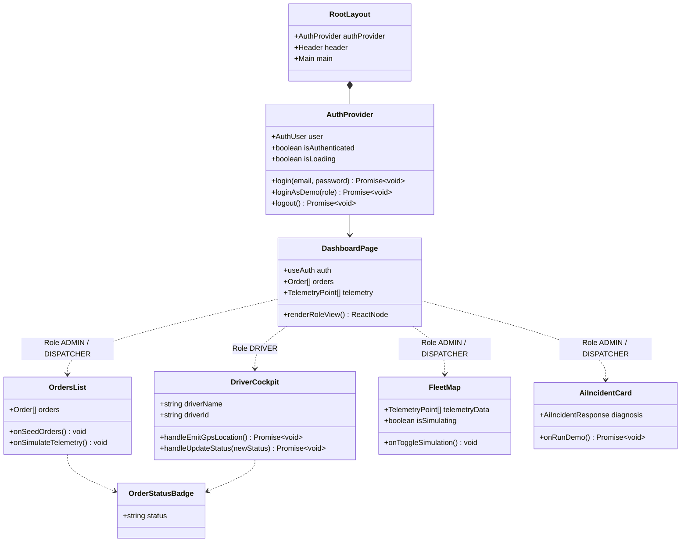

<div align="center">

# 💻 Frontend Web Dashboard (`apps/web`)
### *Panel de Monitoreo Logístico en Tiempo Real, Vistas por Rol (RBAC), Mapa de Flotas e Inteligencia Artificial*


</div>

---

## 📖 1. Descripción General & Propósito

El **`apps/web`** es el cliente web frontend principal de **LogiPulse AI**, desarrollado sobre **Next.js 14+ (App Router)** y **Tailwind CSS**.

Proporciona una consola de control operativa en tiempo real para administradores, despachadores y conductores con:
1. **🔑 Autenticación & Vistas por Rol (RBAC)**: Manejo global del estado de sesión con `AuthContext`, protección de rutas con Next.js Middleware y vistas diferenciadas para `ADMIN`, `DISPATCHER` y `DRIVER`.
2. **🚛 Cabina del Conductor (`DriverCockpit`)**: Vista exclusiva para conductores con emisión de puntos GPS en tiempo real a `telemetry-service` y actualización de estado en la base de datos PostgreSQL de `orders-service` (`IN_TRANSIT`, `DELIVERED`).
3. **🎨 Insignias de Estado Unificadas (`OrderStatusBadge`)**: Componetización visual homogénea de pills animados para estados (`Creada`, `En Tránsito`, `Entregada`, `Incidente en Vía`).
4. **🗺️ Mapa Interactivo de Flota (Leaflet + OpenStreetMap)**: Visualización, auto-encuadre (`fitBounds`) y trazado de ruta histórica (`Polyline`) de camionetas.
5. **⚡ Simulador de Flota en Vivo & WebSockets (`socket.io-client`)**: Transmisión periódica cada 2.5s simulando movimiento fluido de vehículos.
6. **🤖 Panel de Diagnósticos de IA**: Alertas operativas generadas por Groq Cloud LLMs y Tavily Web Search.

---

## 📂 2. Estructura de Directorios & Arquitectura de Carpetas

```text
apps/web/
├── src/
│   ├── app/                                    # 🚀 NEXT.JS APP ROUTER
│   │   ├── globals.css                         # Tailwind CSS global import & Leaflet map custom styles
│   │   ├── layout.tsx                          # Root Layout envuelto en AuthProvider con Header global
│   │   ├── login/
│   │   │   └── page.tsx                        # Página dedicada de Login con accesos rápidos 1-click por rol
│   │   └── page.tsx                            # Dashboard Principal con renderizado adaptativo por rol
│   │
│   ├── context/
│   │   └── AuthContext.tsx                     # Contexto global de sesión (user, role, login, logout, me)
│   │
│   ├── middleware.ts                           # Middleware de Next.js para protección de rutas
│   │
│   ├── components/                             # 🧱 COMPONENTES DE INTERFAZ REACT
│   │   ├── DriverCockpit.tsx                   # Cabina del conductor (emisión GPS + actualización de estado)
│   │   ├── OrderStatusBadge.tsx                # Insignias visuales unificadas de estado
│   │   ├── FleetMap.tsx                        # Contenedor Leaflet MapContainer, Marcadores y Simulador
│   │   ├── MapAutoRecenter.tsx                 # Dynamic bounds fitter mediante useMap() de Leaflet
│   │   ├── OrdersList.tsx                      # Tabla de despachos con insignias unificadas y búsqueda en vivo
│   │   ├── VehicleDetailModal.tsx              # Modal emergente con mapa Leaflet Polyline y métricas del vehículo
│   │   ├── CreateOrderModal.tsx                # Modal con formulario controlled para enviar nuevas órdenes
│   │   ├── LoginModal.tsx                      # Modal interactivo de autenticación JWT
│   │   └── AiIncidentCard.tsx                  # Tarjeta de diagnóstico de incidentes IA con severidad
│   │
│   ├── lib/
│   │   └── api-client.ts                       # Cliente HTTP Nativo (fetch wrapper) para Auth, Orders, Telemetry & AI
│   │
│   ├── types/
│   │   └── index.ts                            # Interfaces y DTOs TypeScript del Frontend (Order, Telemetry, etc.)
│   │
│   └── test/                                   # 🧪 PRUEBAS UNITARIAS DE COMPONENTES & NETWORK MOCKS
│       ├── mocks/
│       │   └── handlers.ts                     # Interceptores de red MSW (Mock Service Worker)
│       └── unit/
│           └── components/
│               ├── OrdersList.spec.tsx         # Unit test de tabla de órdenes
│               ├── AiIncidentCard.spec.tsx     # Unit test de tarjeta de diagnóstico IA
│               ├── CreateOrderModal.spec.tsx   # Unit test del modal de creación de órdenes
│               └── VehicleDetailModal.spec.tsx # Unit test del modal de detalle y trayectoria
│
├── e2e/                                        # 🎭 PRUEBAS END-TO-END (Playwright)
│   └── dashboard.spec.ts                       # Test E2E de carga visual y navegación en Chromium
├── playwright.config.ts                        # Configuración de Playwright Test Runner
├── tailwind.config.js                          # Configuración del motor Tailwind CSS
├── tsconfig.json                               # TypeScript configuration
└── next.config.mjs                             # Next.js configuration (Standalone output)
```

---

## 🏛️ 3. Diagrama de Componentes & Flujo RBAC



---

## 🎨 4. Patrones de Diseño & Buenas Prácticas Frontend

1. **Gestión de Estado de Sesión en React (`AuthContext`)**:
   - Centraliza el estado de autenticación (`user`, `role`, `isAuthenticated`), persistencia en `localStorage` y verificación activa con el backend (`GET /auth/me`).
2. **Vistas Adaptativas basadas en Roles (RBAC UI)**:
   - Renderizado condicional según el rol activo (`ADMIN`, `DISPATCHER`, `DRIVER`), adaptando las acciones y pantallas a cada perfil.
3. **Componetización Visual de Insignias (`OrderStatusBadge`)**:
   - Insignias de estado homogéneas en toda la app (`Creada`, `En Tránsito`, `Entregada`, `Incidente en Vía`).
4. **Next.js Dynamic Imports sin SSR para Leaflet**:
   - `dynamic(() => import('react-leaflet'), { ssr: false })` evita errores de compilación del lado del servidor (`window is not defined`) al cargar componentes de Leaflet.

---

## 🧪 5. Estrategia de Testing & Cobertura

### 📊 Cobertura Actual de Componentes:
* **Resultados**: **4/4 Test Suites Pasadas**, **9/9 Tests Completados (🟢 100% Pass)**.

### 🛠️ Comandos de Prueba:
```bash
# Ejecutar pruebas unitarias de componentes
pnpm test

# Generar reporte de cobertura
pnpm test:cov

# Ejecutar pruebas End-to-End con Playwright
pnpm test:e2e
```
