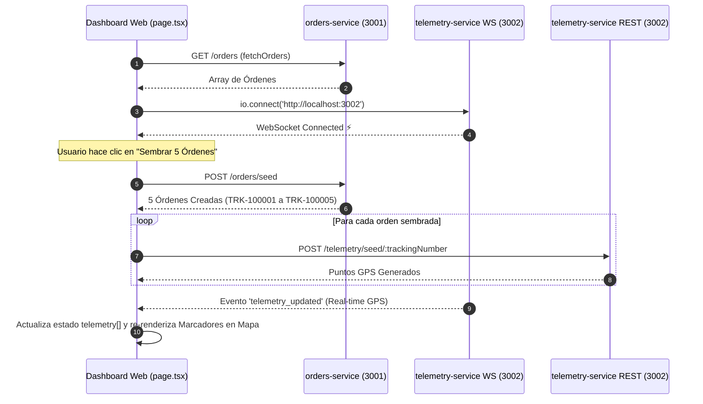

<div align="center">

# 💻 Frontend Web Dashboard (`apps/web`)
### *Panel de Monitoreo Logístico en Tiempo Real, Mapa de Flotas e Inteligencia Artificial*


</div>

---

## 📖 1. Descripción General & Propósito

El **`apps/web`** es el cliente web frontend principal de **LogiPulse AI**, desarrollado sobre **Next.js 14+ (App Router)** y **Tailwind CSS**.

Proporciona una consola de control operativa en tiempo real para despachadores y supervisores de logística con:
1. **🗺️ Mapa Interactivo de Flota (Leaflet + OpenStreetMap)**: Visualización y auto-encuadre (`fitBounds`) de camionetas activas en rutas reales de Chile.
2. **⚡ WebSockets en Tiempo Real (`socket.io-client`)**: Recepción instantánea de actualizaciones GPS transmitidas por `telemetry-service`.
3. **📦 Gestión de Órdenes & Siembra**: Tabla interactiva con badges de estado dinámicos (`CREATED`, `IN_TRANSIT`, `DELIVERED`, `INCIDENT`) y disparadores de seeder para 5 órdenes y telemetría.
4. **🤖 Panel de Diagnósticos de IA**: Alertas operativas generadas por Groq Cloud LLMs y Tavily Web Search.

---

## 📂 2. Estructura de Directorios & Arquitectura de Carpetas

A continuación se detalla la estructura física del código fuente en `src/`:

```text
apps/web/
├── src/
│   ├── app/                                    # 🚀 NEXT.JS APP ROUTER
│   │   ├── globals.css                         # Tailwind CSS global import & Leaflet map custom styles
│   │   ├── layout.tsx                          # Root Layout con Header global e indicadores de WS/AI
│   │   └── page.tsx                            # Dashboard Principal (Conexión WS, Siembra, Grid 3 columnas)
│   │
│   ├── components/                             # 🧱 COMPONENTES DE INTERFAZ REACT
│   │   ├── FleetMap.tsx                        # Contenedor Leaflet MapContainer + TileLayer + Markers (Client-only)
│   │   ├── MapAutoRecenter.tsx                 # Dynamic bounds fitter mediante useMap() de Leaflet
│   │   ├── OrdersList.tsx                      # Tabla de despachos, badges de estado y botón de siembra
│   │   └── AiIncidentCard.tsx                  # Tarjeta de diagnóstico de incidentes IA con severidad
│   │
│   ├── lib/
│   │   └── api-client.ts                       # Cliente HTTP Nativo (fetch wrapper) para Orders, Telemetry & AI
│   │
│   ├── types/
│   │   └── index.ts                            # Interfaces y DTOs TypeScript del Frontend (Order, Telemetry, etc.)
│   │
│   └── test/                                   # 🧪 PRUEBAS UNITARIAS DE COMPONENTES & NETWORK MOCKS
│       ├── mocks/
│       │   └── handlers.ts                     # Interceptores de red MSW (Mock Service Worker)
│       └── unit/
│           └── components/
│               ├── OrdersList.spec.tsx         # Unit test de tabla de órdenes
│               └── AiIncidentCard.spec.tsx     # Unit test de tarjeta de diagnóstico IA
│
├── e2e/                                        # 🎭 PRUEBAS END-TO-END (Playwright)
│   └── dashboard.spec.ts                       # Test E2E de carga visual y navegación en Chromium
├── playwright.config.ts                        # Configuración de Playwright Test Runner
├── tailwind.config.js                          # Configuración del motor Tailwind CSS
├── tsconfig.json                               # TypeScript configuration
└── next.config.mjs                             # Next.js configuration
```

---

## 🏛️ 3. Arquitectura de Componentes Frontend

```text
                                 ┌─────────────────────────────────┐
                                 │           App Layout            │
                                 │      (src/app/layout.tsx)       │
                                 └────────────────┬────────────────┘
                                                  │
                                                  ▼
                                 ┌─────────────────────────────────┐
                                 │          Dashboard Page         │
                                 │       (src/app/page.tsx)        │
                                 └────────┬───────┬───────┬────────┘
                                          │       │       │
                 ┌────────────────────────┘       │       └────────────────────────┐
                 ▼                                ▼                                ▼
   ┌───────────────────────────┐    ┌───────────────────────────┐    ┌───────────────────────────┐
   │         FleetMap          │    │      AiIncidentCard       │    │        OrdersList         │
   │  (Leaflet Map + Markers)  │    │ (AI Diagnostic Component) │    │  (Order Table & Actions)  │
   └─────────────┬─────────────┘    └───────────────────────────┘    └───────────────────────────┘
                 │
                 ▼
   ┌───────────────────────────┐
   │     MapAutoRecenter       │
   │  (Dynamic Bounds Fitter)  │
   └───────────────────────────┘
```

---

## 📐 4. Diagrama de Flujo de Datos & WebSockets



---

## 🎨 5. Patrones de Diseño & Buenas Prácticas Frontend

1. **Next.js Dynamic Imports sin SSR para Leaflet**:
   - `dynamic(() => import('react-leaflet'), { ssr: false })` evita errores de compilación del lado del servidor (`window is not defined`) al cargar Leaflet sólo en el cliente.
2. **Cliente HTTP Nativo Tipado (`fetch`)**:
   - Implementación de `apiClient` en [src/lib/api-client.ts](file:///d:/Programaci%C3%B3n/Wordpress/logipulse-ai/apps/web/src/lib/api-client.ts) utilizando únicamente la API nativa **`fetch`** de Next.js sin dependencias pesadas ni problemas de seguridad de Axios.
3. **Auto-Recenter & Dynamic Bounds Framing**:
   - `MapAutoRecenter` utiliza `useMap()` de Leaflet para calcular dinámicamente el `fitBounds` envolvente de todos los puntos de telemetría activos en pantalla.
4. **Mock Service Worker (MSW) para Testing de Componentes**:
   - Intercepción de peticiones HTTP en pruebas unitarias mediante `msw/node` para emular respuestas del backend sin depender de servicios levantados.

---

## 📡 6. Contrato del Cliente HTTP API (`api-client.ts`)

```typescript
export const api = {
  orders: {
    getAll: () => apiClient<Order[]>('http://localhost:3001/orders'),
    seed: () => apiClient<Order[]>('http://localhost:3001/orders/seed', { method: 'POST' }),
  },
  telemetry: {
    getHistory: (trackingNumber: string) =>
      apiClient<TelemetryPoint[]>(`http://localhost:3002/telemetry/tracking/${trackingNumber}`),
    seed: (trackingNumber: string) =>
      apiClient<TelemetryPoint[]>(`http://localhost:3002/telemetry/seed/${trackingNumber}`, { method: 'POST' }),
  },
  ai: {
    seedDemo: () => apiClient<any>('http://localhost:3003/ai/seed-demo', { method: 'POST' }),
  },
};
```

---

## 🧪 7. Estrategia de Testing & Cobertura

Suite de pruebas dividida en pruebas unitarias/componentes y pruebas End-to-End:

### 📊 Cobertura Actual de Componentes:
* **Resultados**: **2/2 Test Suites Pasadas**, **5/5 Tests Completados (100% Pass)**.

### 🔬 Desglose de Pruebas:
- **Unit & Component Testing (Jest + React Testing Library + MSW)**:
  - `src/test/unit/components/OrdersList.spec.tsx`: Verifica el renderizado de la tabla de despachos, badges de estado y llamada a la función de siembra.
  - `src/test/unit/components/AiIncidentCard.spec.tsx`: Prueba el renderizado de diagnósticos de IA y severidades (`HIGH`, `CRITICAL`).
- **End-to-End Testing (Playwright)**:
  - `e2e/dashboard.spec.ts`: Verifica la interacción en navegador Chromium real.

### 🛠️ Comandos de Prueba:
```bash
# Ejecutar pruebas unitarias de componentes
pnpm test

# Generar reporte de cobertura
pnpm test:cov

# Ejecutar pruebas End-to-End con Playwright
pnpm test:e2e
```
